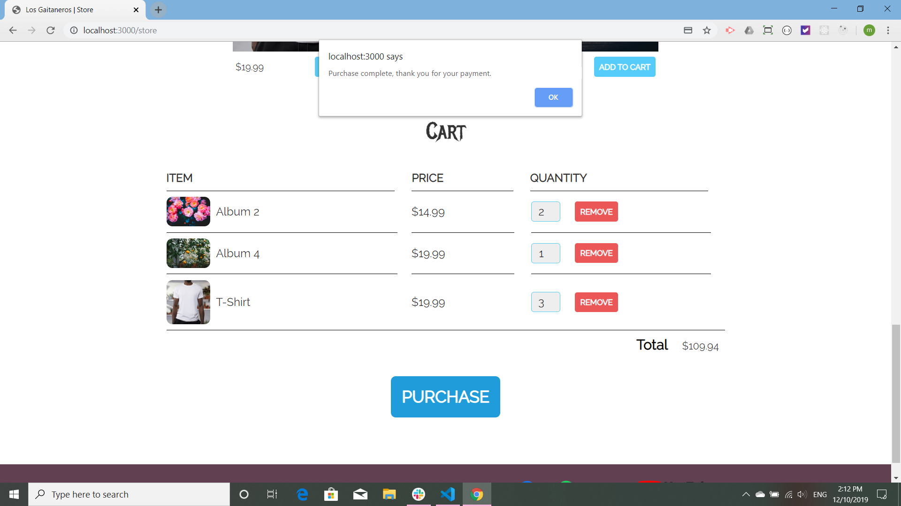

## Shopping Cart

Shopping Cart is a clone of the Web Dev tutorial on building a modern web page [shopping cart tutorial](https://www.youtube.com/watch?v=YeFzkC2awTM&list=PLZlA0Gpn_vH9k5ju1yq9qCDqvtuTVgTr6&index=2&t=33s). In the tutorial the shopping portion of the web page uses stripe to make payments. A Node server is built and the secret keys for stripe are kept in a .env file. My only deviations from the tutorial were to put the routes in their own file and the css in multiple files as the css file was very long (and I wanted to see if it would work).

Here is the shopping cart with some items to be purchased:

This is the pop-up provided by Stripe. [stripe](https://stripe.com/)

Here is dummy information, the card number is a test number provided by Stripe for use in development.

Payment is successful and a message is sent back to the customer.

Finally, upon payment, the cart empties:

Again, I would like to thank WebDev Simplified [Web Dev](https://www.youtube.com/channel/UCFbNIlppjAuEX4znoulh0Cw)! The tutorials are always great. Besides learning about building a shopping cart, I also learned a great deal more about CSS. Thank you!
